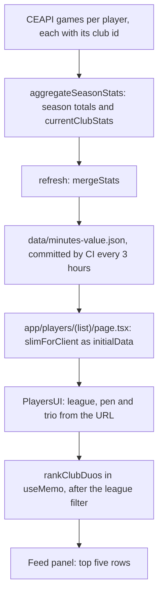
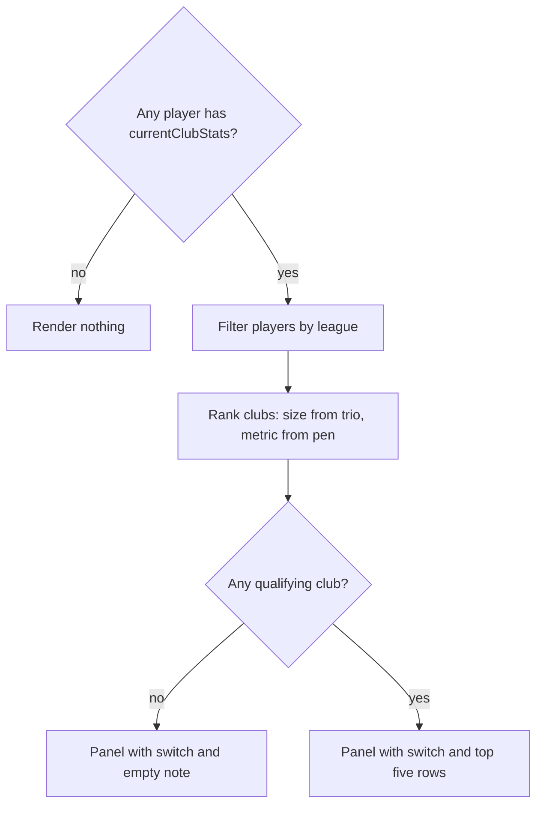

# Club Scoring Duos and Trios - Plan

## Goal Capsule

- **Objective:** A fan on the Players page can see which clubs' top two or three tracked players have produced the most goals and assists for that club, and can check each sum from its row.
- **Means:** record each player's output for their current club in the data refresh (KTD1), rank clubs in the browser from the player data the page already loads (KTD3), and show the top five in a feed panel above the All Players list (KTD5).
- **Authority:** Product Contract requirements win on behavior; KTDs win on mechanism within them; `AGENTS.md` and `DESIGN.md` bind all UI; a unit overrides neither.
- **Stop conditions:** stop and ask if, after the first refresh, more than 5% of tracked players who are neither new signings nor on loan show current-club goals plus assists different from their season goals plus assists (per-game club ids aren't matching crest ids, so R4 can't hold), if the refresh `validate()` guards fail after U1, or if the feed panel can't be extracted without changing the home page.
- **Execution profile:** code. U1 and U2 are test-first in vitest. U3 and U4 are verified in the browser at phone and desktop widths. The panel only appears after the first data refresh that runs U1's code.
- **Finishing:** the implementer commits and pushes to `main` (the repo owner's standing preference), runs or waits for the data refresh workflow, pulls the refreshed data, and verifies in the browser.

---

## Product Contract

### Summary

A panel above the All Players list ranks clubs by the combined npG+A of their top two tracked players, with a switch to trios. Only output for a player's current club counts, which needs a small addition to the data refresh. The panel follows the page's league filter and penalties toggle, and every club and player in it links to their own page.

### Problem Frame

Fans talk about partnerships as much as individuals ("Yamal and Raphinha have 22 between them"), but the Players page only ranks individuals. The tracked pool already covers 99 clubs with at least two players, yet summing season totals would credit the wrong club. The season aggregation deliberately keeps a transferred player's games for their previous club (`aggregateSeasonStats` in `lib/player-aggregation.ts`). That is right for a player's season line and wrong for a club's duo. Several summer signings already carry output from their old clubs: Mika Godts' 4 npG+A as a PSG player include 3 for Ajax, and Moussa Diaby's figures for Leverkusen come from Saudi league games.

### Requirements

**Ranking**

- R1. The Players page ranks clubs by their best scoring duo, with a switch to their best scoring trio.
- R2. A club's duo or trio is its two or three tracked players with the highest output for that club, and each club appears at most once.
- R3. Output is npG+A by default and G+A when the page's Include penalties toggle is on, and the label says which.
- R4. Only goals, assists and penalty goals scored for the player's current club count; output for another club or a national team this season does not.
- R5. A player fills a slot only with at least one goal contribution under the active metric, and a club without enough such players is left out.
- R6. Ties go to fewer minutes played for the club, as the page's G+A sort does, then to name order.

**Placement and filters**

- R7. The section sits under the page header as a two-line summary of the best duo and best trio, and opens the top five clubs on demand, so the explorer keeps the lead.
- R8. The league filter, including Top 5 leagues, narrows the section; the club, nationality, position, age, signing, caps and contract filters, the sort, and the Last 5/Last 10 window don't.
- R9. The duo/trio choice lives in the URL, so a shared link opens the same view, and switching it leaves the All Players list untouched.

**Presentation**

- R10. Each row shows the rank, the club linking to its team page, each player linking to their page with their own figure, and the combined total, so the sum can be checked by eye.
- R11. The header names the metric literally, says the figures count tracked players' output for their current club, and names the league scope it covers, so a screenshot stands on its own.
- R12. The section follows the design system's feed panel and fits a 320px screen without sideways scrolling, dropping headshots and rank chips below 640px so names can wrap.

**Data states**

- R13. The section doesn't render while the data has no current-club figures.
- R14. When the league filter leaves no qualifying club, the panel keeps its switch and says why it is empty.
- R15. How It Works explains the ranking under Player Explorer.

### Key Decisions

- **Rank by combined npG+A, one entry per club.** (session-settled: user-approved — chosen over goals only or listing every pair: it matches the page's own scoring metric and keeps the list to distinct clubs) Governs R2, R3.
- **Count current-club output only.** (session-settled: user-approved — chosen over summing season totals as they are: season totals credit transferred players with output for their old club) Governs R4, R13.
- **Place the section above the All Players list, narrowed only by the league filter.** The other filters describe individual players, not clubs. Governs R7, R8.
- **Cut at five, breaking ties by minutes.** Showing every club tied at the cut, as the home page's picks do, would make the panel's height swing with each filter (clubs level on a total are common early in a season). Governs R6, R7.

### Acceptance Examples

- AE1. Covers R4.
  - **Given:** Mika Godts moved from Ajax to PSG this season with 1 penalty goal and 3 assists for Ajax and 1 assist for PSG.
  - **When:** PSG's duo is ranked.
  - **Then:** Godts counts 1 npG+A, not 4.
- AE2. Covers R5.
  - **Given:** a club has three tracked players and the third has no goal or assist for the club.
  - **When:** Trios is selected.
  - **Then:** the club is absent, while it can still appear under Duos.
- AE3. Covers R13.
  - **Given:** the committed data predates the first refresh that runs U1's code.
  - **When:** `/players` loads.
  - **Then:** no panel renders and no gap is left above All Players.
- AE4. Covers R14.
  - **Given:** the data has current-club figures, the league filter is MLS, and Trios is selected.
  - **When:** the panel renders.
  - **Then:** it shows the switch and an empty note.
- AE5. Covers R3.
  - **Given:** a club's top scorer has penalty goals for the club.
  - **When:** Include penalties is turned on.
  - **Then:** the label reads G+A and that club's total rises by those penalty goals.

### Success Criteria

- After the first refresh following U1, every row's total equals the sum of the figures printed beside its players, and transferred players show only their output for their current club (AE1).
- The home page's Latest Highlights and Latest Standouts render exactly as they did before the feed panel moved.

### Scope Boundaries

- Who assisted whom: the data holds per-game goal and assist counts, not which player set up which goal.
- Players outside the tracked pool, so a club's real best duo can include a player the site doesn't track.
- The section on team or league pages, and page metadata or ⌘K keywords for it.
- Duos and trios over the Last 5/Last 10 window.

#### Deferred to Follow-Up Work

- League deep links: `app/leagues/[slug]/page.tsx` links to `/players?league=La Liga`, but player data says "LaLiga", so the Players list and this section come up empty from La Liga's page. `isSameLeague` in `lib/leagues.ts` already matches both spellings.
- The "All Players" bar header (in `app/players/PlayersUI.tsx` and three times on the Over/Under page) and the long segmented-control class string (five copies) want shared components.
- Labelling the season on the Players page: nothing on the page says which season it shows today, and the panel inherits that gap.
- A `docs/solutions/` note on club-scoped versus season stats once this ships.

---

## Planning Contract

### Key Technical Decisions

- KTD1. **Tally current-club output inside `aggregateSeasonStats` as an optional nested `currentClubStats` object with goals, assists, penaltyGoals and minutes.** (session-settled: user-approved — chosen over summing season totals as they are: season totals credit transferred players with output for their old club) The loop already holds `currentClubId` and each game's `clubsInformation.club.clubId`, and the refresh re-aggregates every cached player from stored raw games, so one run fills the field without refetching. A nested object feeds `npga()` in `lib/stats-toggles.ts` directly and turns "not refreshed yet" into one undefined check. `positionStats` is the precedent for nested stats, and a `club*` prefix used to mean club versus national team (removed in commit 21c030f). Cites R4, R13.
- KTD2. **`currentClubStats` gets no top-flight override.** After the merge, scorer-pool players' `goals` are replaced with top-flight goals (the Arévalo comment in `scripts/refresh-minutes-value.ts`) to decide who enters the pool. Club scoping already removes what that override guards against, another club's or a reserve team's goals, so the new field counts every competition the current club plays. A player now at a lower-tier club can therefore show more for the club than the list's top-flight `goals`; the pool holds very few such players.
- KTD3. **Rank in the browser with a pure, client-safe `lib/` function over `initialData`.** The league filter, penalties toggle and duo/trio switch change the URL shallowly (`update` in `lib/hooks/use-query-params.ts` is a `pushState`), so the server never re-renders for them. `app/club-transfers/ClubTransfersUI.tsx` runs `buildClubWindows` in `useMemo` the same way. The "runs server-side once" rule in `CONTEXT.md` targets computation duplicated behind API routes; here the ranking lives in one place. The module must not import `fs` or the `@/lib/transfermarkt` barrel.
- KTD4. **Group by the club id from `extractClubIdFromLogoUrl(clubLogoUrl)`, and narrow by league before ranking with `filterPlayersByLeagueAndClub(players, leagueFilter, "all")`.** `lib/team-detail.ts` keys clubs the same way, and it is the id U1's tally matches. A player's league is their current club's league (`currentLeagueName`), so filtering players filters whole clubs. All 750 current players have a club id, and no id maps to two leagues.
- KTD5. **Move the home page's `FeedPanel` shell into `components/FeedPanel.tsx` with a right-hand slot, and use shadcn `ToggleGroup` with `variant="outline" size="sm"` for the switch.** `DESIGN.md` names the feed panel as the pattern for short lists, and `AGENTS.md` asks for a shared base over a copy. The outline variant is what `app/fee-vs-value/Leaderboard.tsx` uses, which avoids a sixth copy of the long segmented-control class string.
- KTD6. **Store the switch as `trio=1`, absent meaning duos, and write it with `update`, not `fadeUpdate`.** It follows the page's boolean params (`pen=1`, `xcintl=1`), and `fadeUpdate` dims the All Players list, which R9 rules out.
- KTD7. **Hide the section only when no player in the page's data carries `currentClubStats`.** Hiding it on an empty filtered result would also hide the switch the reader needs to change course (R14).

### High-Level Technical Design

The data path, from the refresh to the panel:



What the section renders in each data state:



Which page controls reach the section (R3, R8, R9):

| Page control                                               | Changes the section           |
| ---------------------------------------------------------- | ----------------------------- |
| League filter, including Top 5 leagues and legacy `top5=1` | Yes: which clubs rank         |
| Include penalties (`pen=1`)                                | Yes: metric, label and totals |
| Duo/trio switch (`trio=1`)                                 | Yes: group size               |
| Club, nationality, position, age, signings, caps, contract | No                            |
| Sort and the Last 5/Last 10 window                         | No                            |

### Risks and Dependencies

- The section stays hidden until a refresh runs U1's code on `main`, either the 3-hourly schedule or a manual run of `refresh-squadstat-data.yml`. The data can't be regenerated locally without refetching the whole pool, and a locally generated JSON would conflict with CI's commits.
- After Aug 1 the refresh can keep aggregating the previous season while current clubs already reflect summer moves, so summer signings show nothing for their new club and drop out. That is correct for the season shown, so the copy must not say "this season".
- `VirtualList` below reads its page offset on each render, so a change in the panel's height is off by one render until the next scroll; the More filters collapsible already does this. Keep the panel's height steady.
- Many clubs have only two or three tracked players, so a single-league view can rank a partial squad; LaLiga's top five by season totals includes Rayo Vallecano and Alavés with two tracked players each. R11's "tracked players" wording discloses this rather than fixing it.
- A player without a `clubLogoUrl` has no club id and drops out silently; all 750 current players have one. A player whose cache entry has no raw games keeps no current-club stats and never fills a slot, with no fallback to season totals.
- `data/minutes-value.json` grows by about 50 KB (about 2%), and the field rides along in every `slimForClient` payload.

---

## Implementation Units

### U1. Current-club tally in the season aggregation

- **Goal:** every player in `data/minutes-value.json` carries their season output for their current club.
- **Requirements:** R4, R13; KTD1, KTD2.
- **Dependencies:** none.
- **Files:** `lib/player-aggregation.ts`, `lib/player-aggregation.test.ts`, `scripts/refresh-minutes-value.ts`, `app/types.ts`.
- **Approach:**
  1. Define the current-club stats shape once in `lib/player-aggregation.ts`, required on `AggregatedStats` and optional on `PlayerStatsResult`.
  2. In `aggregateSeasonStats`, after the first-team check, add a game's goals, assists, penalty goals and minutes when its club id equals a non-empty `currentClubId`. National-team games already `continue` before that point.
  3. `reaggregatePlayerStats` and `fetchPlayerMinutesRaw` in `lib/fetch-player-minutes.ts` spread the aggregate, so both carry the field unchanged; `ZERO_STATS` needs nothing because the field is optional there.
  4. In `mergeStats`, copy the field when the cache entry has it, as the other optional fields are copied.
  5. Add the optional field to `MinutesValuePlayer` in `app/types.ts`, reusing the shape from step 1.
- **Execution note:** write the aggregation tests first.
- **Patterns to follow:** the `game({ clubId, goals, assists, penGoals, national, seasonId })` builder and the `CLUB`, `OTHER_SENIOR` and `B_TEAM` constants in `lib/player-aggregation.test.ts`; `topFlightGoals` sitting beside `goals` with a JSDoc line.
- **Test scenarios:**
  - Games for `OTHER_SENIOR` (1 goal, 2 assists) and `CLUB` (2 goals, 1 assist) in one season: season totals are 3 goals and 3 assists, and current-club stats are 2 goals and 1 assist.
  - One penalty goal for `OTHER_SENIOR` and one for `CLUB`: current-club penalty goals is 1.
  - A `FIWC` national-team game with a goal: current-club stats are unchanged.
  - A `B_TEAM` game with a goal: excluded from current-club stats.
  - A `CLUB` game from another season: excluded.
  - Current-club minutes sum only the `CLUB` games.
  - An empty `currentClubId`: every current-club figure is 0 while season totals still count senior games.
  - `reaggregatePlayerStats` on an entry whose `clubLogoUrl` embeds `CLUB`: the result's current-club stats match only the `CLUB` games.
  - `reaggregatePlayerStats` on an entry without raw games: returned unchanged, with no current-club stats.
- **Verification:** the new tests pass alongside the existing ones. After the first refresh on `main`, players with raw games carry the field, and Mika Godts (748804) shows only PSG games (1 assist when this plan was written).

### U2. Duo and trio ranking

- **Goal:** a pure function turns the player list into clubs ranked by their best duo or trio.
- **Requirements:** R2, R3, R4, R5, R6; KTD3, KTD4.
- **Dependencies:** U1 for the field type.
- **Files:** `lib/club-duos.ts` (new), `lib/club-duos.test.ts` (new).
- **Approach:**
  1. Take the players, a group size of 2 or 3, and whether penalties count. Return every qualifying club in rank order and leave the top-five cut to the caller.
  2. Skip players without current-club stats or a club id, and score the rest with `npga()` on their current-club stats.
  3. Each entry carries the club's id, name, crest URL and league, its members with their own figures, the total, and the members' combined club minutes.
  4. Import only client-safe modules: `@/lib/format` for the club id and `@/lib/stats-toggles` for `npga`.
- **Technical design** (directional, applying R5 and R6):

  ```text
  for each player with currentClubStats and a club id:
    points = npga(currentClubStats, includePenalties)
    if points >= 1: add the player to their club's bucket
  for each bucket holding at least `size` players:
    members = top `size` by points desc, club minutes asc, name
    total = sum of member points; minutes = sum of member club minutes
  order clubs by total desc, minutes asc, club name
  ```

- **Patterns to follow:** `makePlayer(...) as MinutesValuePlayer` in `lib/minutes-regression.test.ts` for fixtures; `buildClubWindows` in `lib/fee-vs-value.ts` for a pure club-grouping function.
- **Test scenarios:**
  - Three clubs with four scoring players each: size 2 and size 3 each return one entry per club holding exactly its top two or three, with the clubs in total order.
  - A player with 10 season G+A but no current-club stats: never appears. Covers AE1.
  - A player with 5 club goals, 3 of them penalties: counts 2 plus assists by default and 5 plus assists with penalties included, and the club's position can change.
  - A club whose third player has 0 under the active metric: included for size 2, absent for size 3. Covers AE2.
  - Two players level on points within a club: the one with fewer club minutes takes the slot.
  - Two clubs level on total: fewer combined club minutes ranks first, then club name.
  - A player whose `clubLogoUrl` yields no club id: ignored.
  - Two clubs with the same name but different ids: separate entries.
  - No player carries current-club stats: an empty result.
- **Verification:** the tests pass, and the module stays client-safe (U4's import of it passes typecheck).

### U3. Shared feed panel

- **Goal:** the design system's feed panel becomes a shared component that can hold a control on its right.
- **Requirements:** R12; KTD5.
- **Dependencies:** none.
- **Files:** `components/FeedPanel.tsx` (new), `app/page.tsx`, `app/components/HomeSkeletons.tsx`, `DESIGN.md`.
- **Approach:**
  1. Move the panel shell out of `app/page.tsx` into `components/FeedPanel.tsx`: section, title and description, right-hand slot, hairline row list and empty text. Rows arrive as children, the right-hand slot takes any node, and the heading level (already `h2` or `h3`) and list type (ordered for rankings) are options.
  2. The home page passes in its "Open" link and snapshot rows, so its markup stays the same.
  3. Move `FeedPanelSkeleton` from `app/components/HomeSkeletons.tsx` next to the panel and let callers supply the row placeholder; the home skeletons keep today's row.
  4. Point `DESIGN.md`'s feed panel entry at the new file and note that the right-hand slot may hold a switch.
- **Test expectation:** none -- a move with no change in behavior; the home page is the check.
- **Verification:** the home page's Latest Highlights, Latest Standouts and loading skeleton look identical at 320px and 1280px, and typecheck and lint pass.

### U4. Duos and trios panel on the Players page

- **Goal:** the Players page shows the ranked panel above the All Players list.
- **Requirements:** R1, R3, R7, R8, R9, R10, R11, R12, R13, R14, R15; KTD5, KTD6, KTD7.
- **Dependencies:** U2, U3.
- **Files:** `app/players/ClubDuos.tsx` (new), `app/players/PlayersUI.tsx`, `app/players/(list)/loading.tsx`, `app/how-it-works/page.tsx`.
- **Approach:**
  1. `PlayersUI` renders the section inside its header block, passing `players`, `leagueFilter` and `includePen`, which it already derives. The section leads with the best duo and best trio as two linked lines, and a "Top 5" collapsible trigger opens the feed panel below them.
  2. The panel reads and writes `trio` through `useQueryParams("/players")` and memoizes the league filter, `rankClubDuos` and the first five, with a one-line comment citing why it runs client-side (KTD3).
  3. The header carries an `h2` title naming duos or trios, a description line per R3 and R11 whose scope reads "All leagues", "Top 5 leagues" or the league's name, an `InfoTip` stating the tie-break and that previous clubs and national-team games don't count, and the switch on the right.
  4. The switch has an `aria-label`, ignores the empty value Radix sends when the pressed option is clicked again (the list's `if (!v) return` guard), and gives its selected segment a fill that stands out from the panel surface, since the list's `bg-elevated` matches the panel.
  5. Rows form an ordered list. Each row runs left to right: `RankBadge` from 640px, the club crest on a white tile, the club name linking to `getTeamDetailHref` over a wrapping line of members joined by "+", and the total with its label on the right. A member is a name linking to `getPlayerDetailHref` and their own figure, with a small `PlayerAvatar` from 640px.
  6. Numbers use `font-value` at regular weight, ranks stay neutral, and colour appears only where it signals.
  7. In `app/players/(list)/loading.tsx`, add a panel placeholder with five rows between the header and the All players label, built from U3's skeleton.
  8. Add a Key stats bullet to the Player Explorer section of `app/how-it-works/page.tsx` covering the ranking, the current-club rule and the tie-break.
- **Patterns to follow:** `components/PlayerListRow.tsx` for row spacing and hover, without making the whole row one link; `LeagueChip` in `app/players/PlayersUI.tsx` for a logo on a white tile; `app/fee-vs-value/Leaderboard.tsx` for the outline `ToggleGroup` with an `aria-label`.
- **Test scenarios** (in the browser; the repo has no component test setup):
  - With the committed data from before the first refresh: no panel renders and no gap is left. Covers AE3.
  - After the refresh, `/players` shows the panel above All Players with five rows, and each row's total equals the sum of its members' figures.
  - Selecting Trios adds `trio=1` and shows three members per row, and the All Players list neither dims nor reorders; a reload keeps Trios, and Back returns to Duos.
  - Clicking the already-selected option leaves the view as it was, and the selected option is visibly filled inside the panel.
  - Turning on Include penalties switches the label to G+A and raises the totals of clubs with penalty scorers. Covers AE5.
  - League set to Premier League shows only Premier League clubs and the description names the Premier League; Top 5 leagues shows only top-five-league clubs, and `?top5=1` behaves the same.
  - League set to MLS with Trios selected shows the empty note with the switch still visible. Covers AE4.
  - Changing the club, nationality or position filter, the sort, or the Last 5 window leaves the panel as it was.
  - At 320px the page doesn't scroll sideways, rank chips and headshots are hidden, and a trio holding long names such as Pierre-Emerick Aubameyang or Sergej Milinković-Savić wraps inside its row; club and player links open the right pages.
  - The loading skeleton shows the panel placeholder where the panel renders.
- **Verification:** every scenario passes at 320px and 1280px, How It Works shows the new bullet, and typecheck and lint pass.

---

## Verification Contract

| Gate       | Command or check                                                                                                                                                               | Units  |
| ---------- | ------------------------------------------------------------------------------------------------------------------------------------------------------------------------------ | ------ |
| Unit tests | `bunx vitest run --dir lib`; plain `bun run test` also runs duplicate tests from a stale `.claude/worktrees/` checkout                                                         | U1, U2 |
| Types      | `bun run typecheck`, also the pre-push hook                                                                                                                                    | All    |
| Lint       | `bun run lint`                                                                                                                                                                 | All    |
| Formatting | `bunx oxfmt --write` on touched files only; never `bun run fmt`, which expands the minified `data/*.json`                                                                      | All    |
| Data       | after the first refresh on `main` (scheduled every 3 hours, or `refresh-squadstat-data.yml` run by hand), pull the refreshed data and confirm players carry `currentClubStats` | U1     |
| Browser    | `/` and `/players` at 320px and 1280px, before and after the refresh                                                                                                           | U3, U4 |

---

## Definition of Done

- R1 through R15 hold on `/players` after the first data refresh following U1.
- The test, typecheck and lint gates pass, and the home page renders as it did before.
- The diff holds no code from abandoned attempts, no locally regenerated `data/*.json`, and no files beyond those the units name.
- Per unit:
  - U1: its tests pass, and refreshed data carries current-club stats, with Godts showing only PSG games.
  - U2: its tests pass, and the module is client-safe.
  - U3: the home page looks identical at both widths.
  - U4: every browser scenario passes at both widths.
